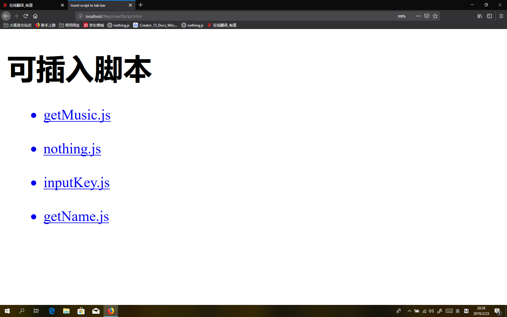
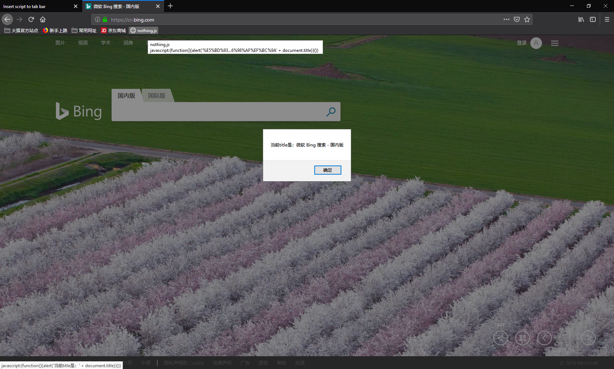

# InsertScript

## 目标
实现一个可以将 js 脚本添加到 a 标签中，实现类似插件功能的效果。

## 使用方法
1. 启动服务器
    node server.js

2. 在浏览器中打开 localhost,访问insertScript.html
    将要使用的脚本拖拽至标签栏
    

3. 当浏览其他页面时，点击标签栏，就会自动执行对应的脚本。

    

## 文件夹说明
- www 目录是外部可访问目录
    - index.html 为入口导航栏
    - files 是导航栏目录
    - script 为可添加的脚本所在目录
    - js 为依赖的脚本
- img 图片库

## 使用说明
当需要添加插件时，将写好的 js 脚本移动到 script 目录下。
就可以在页面中自动访问到了。